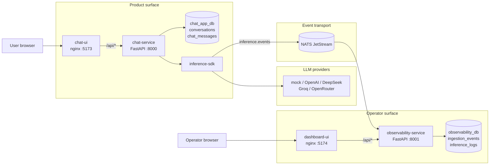
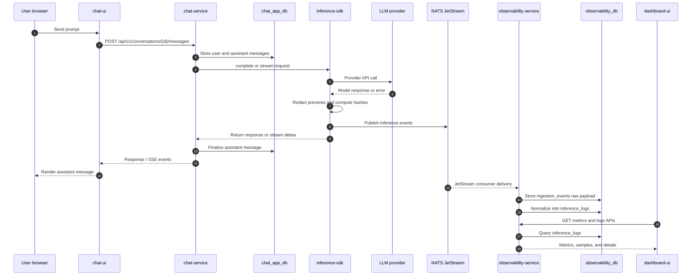

# Architecture Notes

## Product Boundary

This project treats the chat application and inference observability stack as separate product boundaries.

- `chat-service` owns user-facing conversation state and message history.
- `inference-sdk` wraps foundation model calls and emits telemetry.
- `observability-service` owns ingestion, validation, normalization, dashboard APIs, and observability storage.
- `chat-ui` is the product-facing SPA. It is paired with `chat-service` and never talks to the observability service.
- `dashboard-ui` is the operator-facing SPA. It is paired with `observability-service` and never talks to the chat service.
- NATS JetStream decouples the two backends. There is no direct HTTP call between them.

## System Architecture

## Ingestion Flow

The observability service also exposes `POST /v1/ingest/events` for SDKs that cannot publish to NATS directly and for contract testing.

Each frontend is intentionally I/O-only and talks to *only one* backend through its own nginx proxy. Single-origin per UI means no CORS preflights. SSE streaming works through `chat-ui`'s nginx because `proxy_buffering` is disabled in its `/api/` location block, so chunks flush to the browser as they arrive.

## Logging Strategy

The SDK emits one telemetry event per actual LLM provider call. Streaming chunks are not stored individually. A streaming call emits one final event containing total latency, time-to-first-token, token usage when available, status, previews, hashes, and provider metadata.

Previews are redacted before emission. The SDK emits `redaction_policy`, `redaction_types`, `redaction_count`, and per-side truncation metadata so dashboards can show whether sensitive content was removed without storing the original values. Full prompts and full responses are not stored in the observability database.

Redaction modes are controlled with `PII_REDACTION_MODE`:

- `standard`: replace detected PII/secrets with typed placeholders.
- `strict`: if any PII is detected, replace the whole preview with `[REDACTED_PREVIEW]`.
- `off`: disable redaction for local debugging only.

## Frontends

There are two separate React + Vite + TypeScript SPAs, deliberately not bundled together — the product UI and the operator UI ship as independent services and depend on different backends.

### `chat-ui` (:5173)

- Surfaces: hero "welcome" page with composer + suggestions, chat thread page with sidebar of conversations grouped by date.
- Behaviors: create / list / resume / cancel conversations, send messages, switchable streaming vs unary, provider/model picker.
- Streaming uses `fetch` + `ReadableStream` to consume the `text/event-stream` body because native `EventSource` does not support `POST` and the streaming endpoint is `POST /v1/conversations/{id}/messages/stream`.
- Stopping a response calls `POST /v1/conversations/{id}/messages/{message_id}/cancel`, which cancels only the pending assistant message and keeps the conversation active. Cancelling a transcript uses `POST /v1/conversations/{id}/cancel` and closes the conversation.

### `dashboard-ui` (:5174)

- Overview page: KPI strip (requests, success rate, p95 latency, tokens, est. cost) with deltas vs the previous window and inline sparklines, then request-rate and latency line charts with hover crosshair tooltips, then provider donut / model bar list / status donut, then a "recent inference calls" table.
- Inference logs page: filterable, free-text searchable, click-through to a detail page that shows normalized attributes + previews + raw `provider_metadata`/`request_params`.
- Models page: per-model share, requests, errors, avg latency, tokens, cost.
- Range picker is `15m / 1h / 6h / 24h / 7d`; bucket size is chosen per range so the chart resolution is appropriate. Overview auto-refreshes every 15s.
- All charts are hand-drawn SVG (no charting library) — keeps the bundle small and the visual language coherent with the rest of the surface.

## Scaling Considerations

- Chat and observability databases are logically separate to avoid coupling product state with telemetry state.
- NATS JetStream gives at-least-once delivery and replayability for inference events.
- The observability consumer is idempotent on `event_id`.
- For high-volume production usage, move inference logs from Postgres to ClickHouse and keep Postgres for metadata/configuration.
- OpenTelemetry Collector can be inserted before the observability service if we want standard OTLP ingestion, batching, processor-based redaction, and vendor interoperability.
- Both frontends are static artifacts, so horizontal scaling is just running more nginx pods per UI behind a load balancer; there is no shared frontend state.
- Because the two UIs are independent, the observability surface can be deployed on a separate origin / private network behind authentication without touching the product surface.

## Deployment Topology

Docker Compose is the fastest local path. The Kubernetes manifests in `k8s/` preserve the same network contract with service names `chat-service` and `observability-service`, so the frontend nginx proxy configuration does not change between Compose and Kubernetes.

The Kubernetes layout is split into `k8s/base` for reusable manifests and `k8s/overlays/remote` for registry/hostname overrides. The root `k8s/` kustomization points at the base for local clusters.

The self-hosted Kubernetes topology uses:

- Deployments for `chat-service`, `observability-service`, `chat-ui`, and `dashboard-ui`.
- StatefulSets with PVCs for Postgres and NATS JetStream.
- A ConfigMap for the Postgres bootstrap SQL that creates `chat_app_db` and `observability_db`.
- An externally-created `ollive-secrets` Secret for database URLs and provider keys.
- An optional nginx Ingress with separate hosts for the product and operator surfaces.

The checked-in manifests are intentionally demo-oriented: single-instance Postgres/NATS and local image names in the base. A production deployment should replace those with managed or HA data services, external secret management, authenticated ingress, TLS, backup/restore, and retention policies.

## Failure Handling Assumptions

- SDK logging is fail-open: telemetry failures do not break chat responses.
- If the observability worker is down, events remain in JetStream until consumed.
- If duplicate events are delivered, `event_id` prevents duplicate normalized logs.
- Invalid payloads are stored in `ingestion_events` with validation errors for debugging.
- Chat history remains available even if observability is unavailable.
- If the observability service is unreachable, `dashboard-ui` surfaces an inline banner per request, but `chat-ui` is unaffected because it doesn't depend on the observability service at all.
- If the browser disconnects mid-stream, the chat-service finalises the assistant message as `cancelled` without closing the conversation, and the SDK emits a terminal inference event with `status = "cancelled"` when cancellation reaches the provider wrapper.

## Production Improvements

- Replace Postgres analytics queries with ClickHouse.
- Add OpenTelemetry Collector support for OTLP traces and metrics.
- Add auth for chat and ingestion APIs.
- Add tenant/project-level isolation.
- Add disk-backed collector queues or Kafka/Redpanda for larger durability requirements.
- Add retention policies for raw events and normalized logs.
- Add full prompt/response object storage as an explicit opt-in with stronger access controls.
